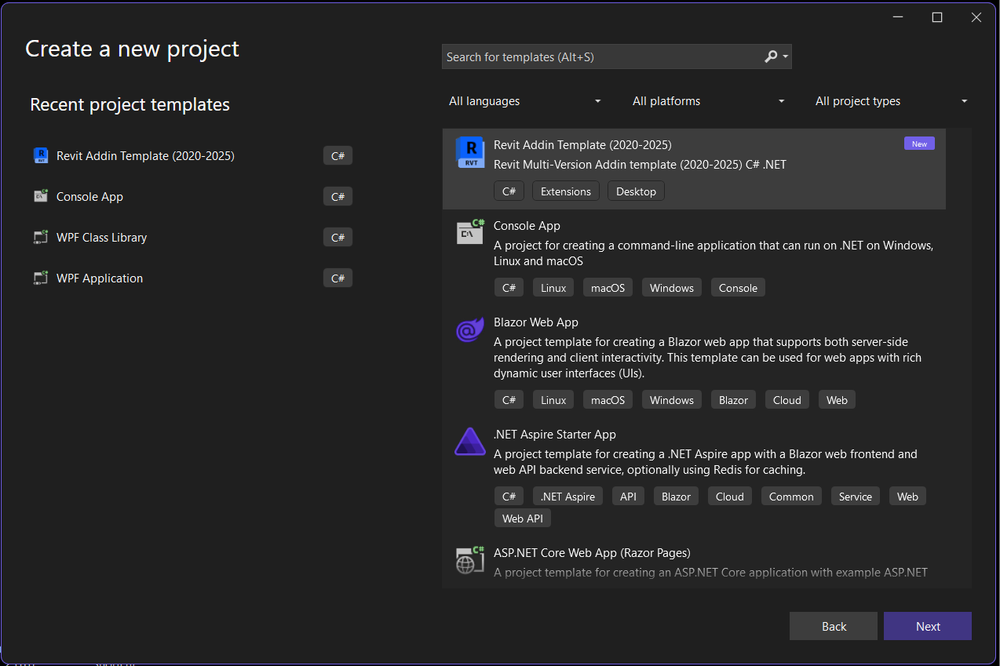
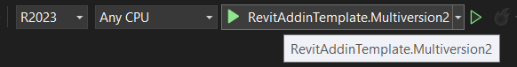

# Revit Multiversion Addin Template for Visual Studio 2022
[](../..)
[](LICENSE)
[](../../actions)


## Description
- This is basic Revit Add-in template for Visual Studio
- It uses configurations to target different versions of Revit
- Using [Revit_All_Main_Versions_API_x64](https://www.nuget.org/packages/Revit_All_Main_Versions_API_x64) nuget package as a reference to Revit API
- Has a post-build event that copied all files to the Revit Addins folder located in ```%appdataAutodesk\Revit\Addins```
- Supports Revit 2020 to 2025

## Installation 
To install the template, download the zip file from the latest [Release](https://github.com/romangolev/RevitAddinTemplate.Multiversion/releases) and copy it to the following location:

```
%USERPROFILE%\Documents\Visual Studio 2022\Templates\ProjectTemplates
```

Or download and run VSIX file attached to the release in order to install the template. The template will apear as an extension for Visual Studio

Or simply install this extension from a Visual Studio Marketplace [Revit Multiversion Addin Template](https://marketplace.visualstudio.com/items?itemName=RomanGolev.RevitAddinTemplateMultiversion)

## Usage
- Create new project in Visual Studio and select the template from the list.
- Select the version of Revit in the list of configurations
- By starting project you'll trigger a new session of Revit attached to the template 
- Develop you plugin and have fun ;)


After installing the extension, you can create a new project by selecting the Revit Multiversion Addin Template from the list of templates in Visual Studio:



To run the project, select the version of Revit you want to run the plugin in the list of configurations and hit play button:



✌️ [Roman Golev](https://www.romangolev.com/), 2025
